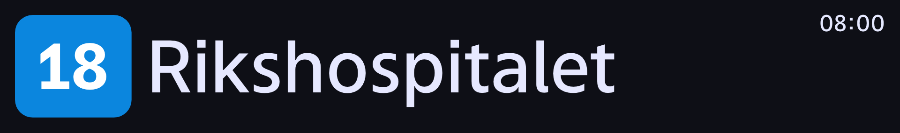

# DPI Bus Monitor Screen Configuration

DPI Bus-monitor supports a range of pre-defined display types depending on size of the screen, screen location and functional needs.
These screens are accessible directly through a URL with following schema: `{BaseURL}/app/#display/{type}`, eg. `http://webserver.local/app/#display/1`.

## Overview of screen types

| Id | Content | Aspect ratio | Optimal screen resolution (width x height) | Vehicle type
|----|---------|--------------|--------------------------------------------|------------- 
| 1  | Journey, Media | 32:9 | 1920x540 | Bus
| 2 | Horizontal journey | 48:9 | 1920x360 | Bus
| 3 | Journey | 16:9  | 1920x1080, 960x540 | Bus
| 4 | Journey / Media | 16:9 |  1920x1080, 960x540 | Bus
| AB-1 | Journey | 8:13*  | 800x1300* | Autonomous bus
| AB-2 | Campaigns, Deviation | 8:13*  | 800x1300* | Autonomous bus
| t2-left | Journey |  1920:197 | 1920x197 | Tram (SL18)
| t2-right | Journey (reverse) |  1920:197 | 1920x197 | Tram (SL18)
| t3 | Next stop, destination |  128:9 | 1920x285 | Tram (SL18)

\* These are approx. values and subject to change.

## Screen configurations on bus (Romerike, Oslo Vest and Indre Oslo)

### Screen config 1

Running state of config 1, displaying journey (60% of the width) and next hubs (fallback, when no media, deviations or announcements are showing).

This is the only configuration used for 32:9, and *all* 32:9 screens must be configured to use this configuration.

Config 1 showing an example deviation. 

### Screen config 2

Running state of config 2. 
This is the only configuration used for 48:9, and *all* 48:9 screens must be configured to use this configuration.

### Screen config 3

Running state of config 3. 
Intended for screens dedicated to showing journey, i.e. media content (campaign, video) and deviations / announcements will be ignored.

### Screen config 4

Running state of config 4. 
Default state for config 4 is showing journey.

Showing announcement.
Media and deviations / announcements will -- when active -- replace journey. 

### Assignment of screen config id for screens
General rule of thumb for assignment of configuration id: 

1. All 32:9 (1920x540) screens should always be assigned config 1
2. All 48:9 (1920x360) screen should always be assigned config 2
3. All 16:9 (1920x1080 or 960x540) should always be assigned config 3, if any of these conditions are met:
  1. This is the only screen on board
  2. This screen is in front of the bus
4. Screen config 4 is used for the *right* screen when 2x 16:9 screens are horizontally aligned, facing the same way (cf. example 1). (For all other 16:9 screens, use config 3)

Example 1

## Autonomous buses (Ski Vest)

### Screen config AB-2

Running state of ab-1. This is the only state with the exception of fallback screens (cf. [trouble shooting](docs/client/troubleshooting-client) for this config.

### Screen config AB-2 (campaigns and deviation)

Campaigns alternate and are time controlled. Deviations are displayed on-demand.

## Tram (SL18)

### Screen config t2-left
Left side of the tram when active cab is c1.

Running state of t2-left. This is the only state (cf. [trouble shooting](docs/client/troubleshooting-client) for this config.

### Screen config t2-right
Right side of the tram when active cab is c1.

Running state of t2-left. This is the only state (cf. [trouble shooting](docs/client/troubleshooting-client) for this config.

### Screen config t3

#### State 1 - doors unlocked

#### State 2 - next stop produced

#### State 3 - next stop produced with active stop signal

